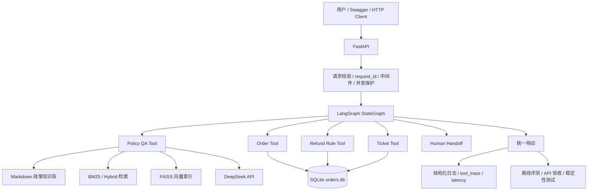
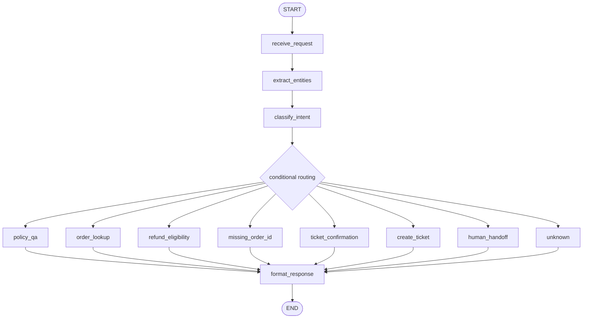

# 项目架构

## 总体系统架构

FastAPI 负责 HTTP 层的请求校验、request_id、并发保护、超时和依赖注入。LangGraph 负责单次请求中的节点流转和工具路由。业务结论仍由既有 Tool、规则引擎和 RAG 服务输出。

## LangGraph 工作流

## 关键设计说明

退款判断不交给 LLM，是因为它依赖支付状态、发货状态、签收时间、拆封情况和质量问题等结构化事实。规则引擎的输出更稳定、可测试、可复现。

工单创建必须显式确认，因为它会写入本地 SQLite 模拟数据库。用户只是表达不满、询问人工客服或提到投诉时，系统不会自动创建工单。

Policy QA 与订单级判断分离，是为了避免通用政策解释替代订单事实判断。比如“保修多久”可以由政策问答回答，但“ORD10004 能不能退款”必须查订单并走退款规则。

State 是单次请求在节点间传递的信息，不是长期 Memory。它保存本次请求的意图、订单号、工具结果、响应状态、调试信息和工具轨迹。

当前使用规则路由基线，是因为任务类型有限、边界清楚、可测试性强。局限是对更开放、更隐晦或多轮上下文表达的泛化能力有限。
